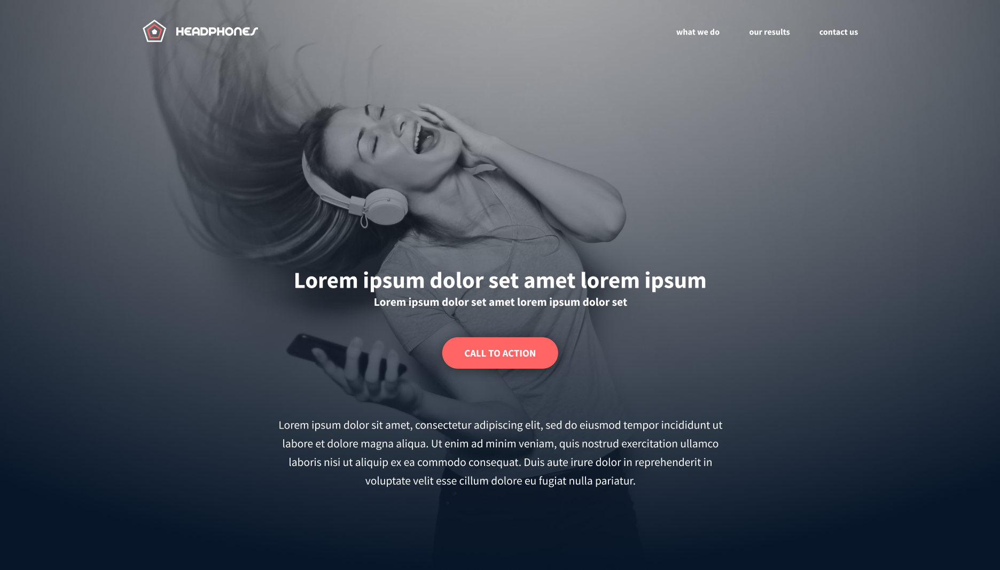

# Implement a Design from Scratch

## Introduction

This project is about implementing a fully functional web page based on a designer's file. The goal is to create a web page that closely mirrors the provided design using only HTML and CSS. The challenge is to accomplish this without relying on external CSS frameworks or JavaScript, ensuring that the final product is both accessible and responsive.



## Table of Contents

- [Project Overview](#project-overview)
- [Design Reference](#design-reference)
- [Requirements](#requirements)
- [Getting Started](#getting-started)
  - [Prerequisites](#prerequisites)
  - [Installation](#installation)
- [Implementation Details](#implementation-details)
  - [CSS Reset](#css-reset)
  - [CSS Variables](#css-variables)
  - [CSS Selectors](#css-selectors)
  - [HTML Structure](#html-structure)
  - [Responsive Design](#responsive-design)
- [Final Screenshots](#final-screenshots)
- [Best Practices](#best-practices)
- [Contributing](#contributing)
- [License](#license)

## Project Overview

The primary objective of this project is to implement a web page from scratch that looks identical to the provided design. This task is designed to mimic real-world scenarios where developers often work closely with designers to bring their visions to life. You'll have the freedom to choose your approach, but the end result must be a pixel-perfect representation of the designer's work.

## Design Reference

The web page design for this project was created by Nicolas Philippot, a UI/UX designer. You can view the final design screens [here](https://www.figma.com/design/FfnVADRC9xgI3yiZliTBYZ/Holberton-School---Headphone-company?node-id=0-1&t=LqZ6nUy9kKGaXyoX-0).

## Requirements

- No external CSS frameworks (e.g., Bootstrap) are allowed.
- No JavaScript should be used.
- The web page must be accessible and responsive.

## Getting Started

### Prerequisites

Before you start, ensure you have a basic understanding of:

- HTML5 and semantic markup
- CSS3 and responsive design techniques
- Accessibility principles

### Installation

1. Clone the repository to your local machine:

```bash
   git clone https://github.com/yourusername/project-name.git
   cd project-name
```

2. Open the project in your preferred code editor.

3. Open `index.html` in your web browser to view the page.

## Implementation Details

### CSS Reset

To ensure consistent styling across different browsers, it's important to reset the default CSS styling. This can be done by including a CSS reset at the beginning of your stylesheet.

### CSS Variables

Using CSS variables will help you manage colors, fonts, and other design tokens more efficiently. Define your variables at the start of your CSS file:

```css
:root {
    --primary-color: #123456;
    --secondary-color: #abcdef;
    --font-family: 'Arial, sans-serif';
}
```

### CSS Selectors

When writing CSS selectors, aim for simplicity and reusability. Avoid overly specific selectors to keep your stylesheets clean and maintainable.

### HTML Structure

Build your HTML structure using semantic tags where possible. `div` containers will help you create a flexible layout, but remember to use tags like `header`, `nav`, `section`, and `footer` to enhance accessibility.

### Responsive Design

Implement responsive design techniques such as media queries to ensure that the page looks good on all screen sizes. Start with a mobile-first approach and then scale up for larger screens.

## Final Screenshots

Include screenshots of the final implementation to showcase how well it matches the design.

## Best Practices

- Start building the page from the outside in and top to bottom.
- Use generic CSS selectors where possible to keep your CSS maintainable.
- Always test your web page for accessibility and responsiveness.

## Contributing

Contributions are welcome! If you have suggestions or improvements, feel free to submit a pull request.

## License

This project is licensed under the [MIT License](https://en.wikipedia.org/wiki/MIT_License).
